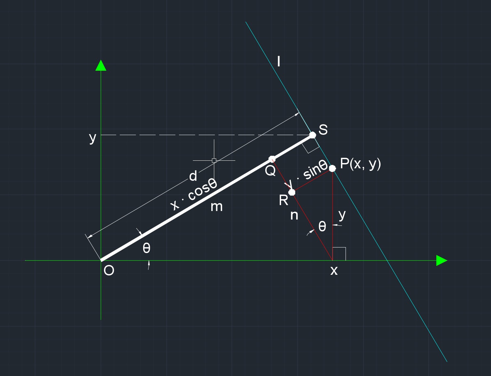

# 直线法线式的几何证明

法线式
​	x * cosθ + y * sinθ - d = 0

###  几何证明：

 在直角坐标系画任意斜线l，从坐标原点O画垂直于l的线段m,垂足为S。 取l上任一点P(x, y)。从坐标(x, 0)引垂直于m的线段n，垂足为Q。从P(x, y)引垂直于n的线段PR，垂足为R。

 原点O到直线l的距离

 ​	d = OQ + QS

 OQ = x * cos θ， QS = y * sin θ

 则  x * cos θ + y * sin θ - d = 0

推广：

设线段OS与X轴的夹角为ωx = θ， 线段OS与Y轴的夹角为ωy = 90°- θ

则得 x * cos(ωx) + y * cos(ωy)  - d = 0

写成行列式：

​	[ cos(ωx) cos(ωy)]  * [x y]T - d = 0 ( T是转置的意思)

三维平面的法线式则有：

​	[ cos(ωx) cos(ωy) cos(ωz)]  * [x y z]T - d = 0

更高维超平面可以简写为

​	ω · X - d = 0